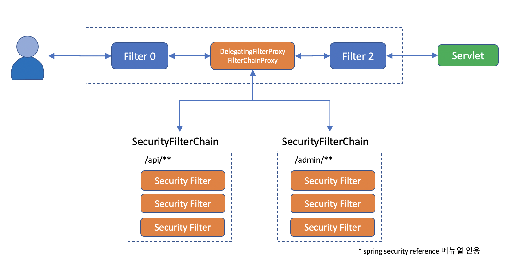
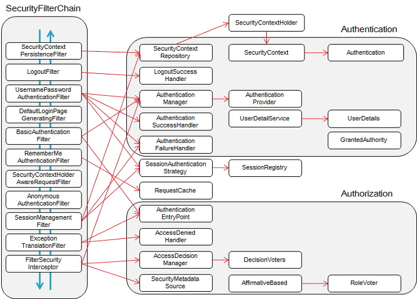
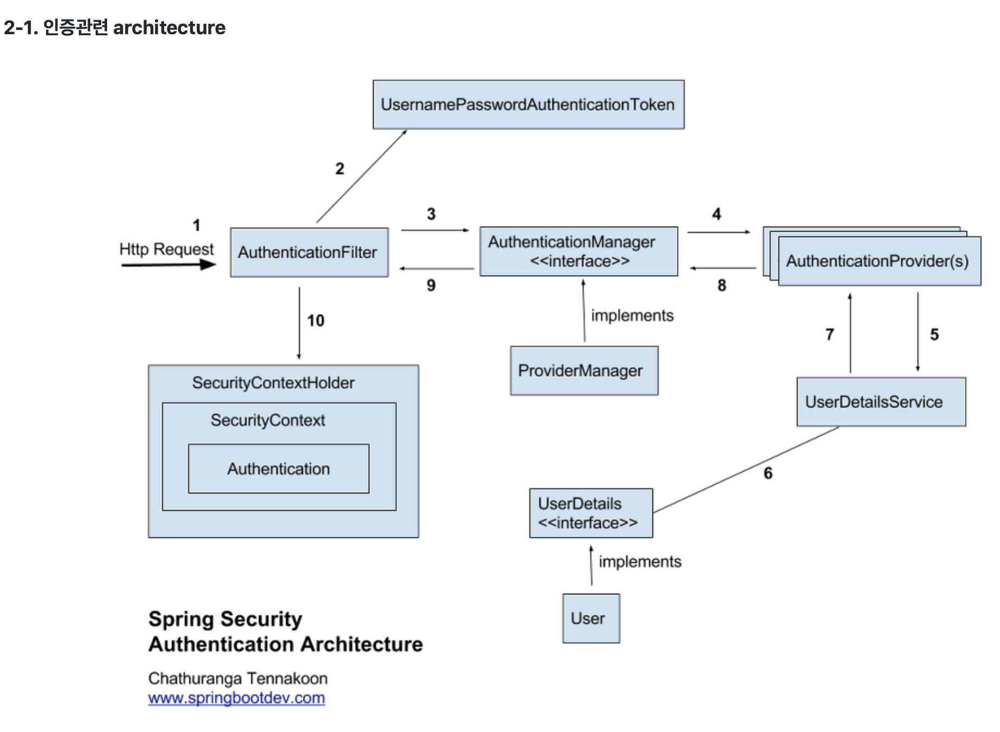
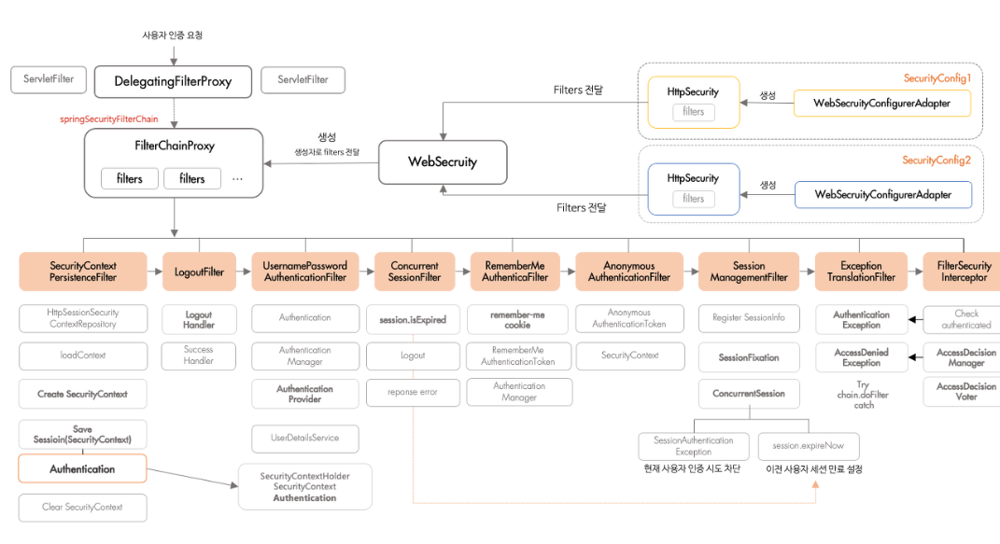

# Spring Security
- Spring Security를 적용하여 인증과 인가 관련 기능 구현을 목표하는 레포지토리

## 학습목표
- Spring Security 프레임워크 사용법과 구조를 학습

## Spring Security란?
Spring Security는 인증, 권한 관리 그리고 데이터 보호 기능을 포함하여 웹 개발 과정에서 필수적인 사용자 관리 기능을 구현하는데 도움을 주는 Spring의 강력한 프레임워크입니다.

일반적으로 개발 시 가장 먼저 작업하는 부분이 사용자 관리 부분으로 가볍게는 회원가입부터 로그인, 로그아웃, 세션 관리, 권한 관리까지 온라인 플랫폼에 맞춰 다양하게 작업되는 인가 & 보안 기능은 개발자에게 많은 시간을 요구하는데요.

Spring 생태계 내에서 이러한 요구사항을 효과적으로 지원하기 위해 개발된 것이 Spring Security로 개발자들이 보안 관련 기능을 효율적이고 신속하게 구현할 수 있도록 도와줍니다.

## Spring Security 구조
[출처 : https://velog.io/@choidongkuen/Spring-Security-Spring-Security-Filter-Chain-%EC%97%90-%EB%8C%80%ED%95%B4]  
[출처 : https://hello-judy-world.tistory.com/216]
  
- 기본적으로 Tomcat기반 Http통신을 하게 되면 클라이언트가 서버에 요청을 하게되는데 해당 요청이 필터를 거쳐 Servlet에서 비지니스 로직을 처리하여 클라이언트에게 응답을 해준다.
이때 Spring Security는 Filter부분에 DelegatingFilterProxy라는게 추가되어 동작하게 된다. DelegatingFilterProxy는 아래 그림과 같은 Filter들이 존재하고 각 Filter들이 수행하는 동작을 확인할수 있다.  

  
- Spring Security 프레임워크에서 기본적으로 제공하는 필터들의 목록은 SecurityFilterChain에 해당하며, 이는 보안 처리를 위한 일련의 필터들이 구성된 체인입니다. 이 필터들은 빨간 화살표로 연결된 오른쪽 부분의 클래스들을 호출하게 되며, 각 클래스는 인증(Authentication)과 인가(Authorization) 처리에 대해 구분하여 담당합니다.  
  
  따라서, Spring Security는 필터 체인을 통해 인증 및 인가 관련 기능을 분리하고, 각각의 역할을 담당하는 클래스를 호출하여 보안 처리를 수행합니다.   

  
- 위 그림은 로그인과 관련된 UsernamePasswordAuthenticationFilter가 수행하는 로직을 도식화한 그림이다.  
1. 인증/인가 HTTP요청을 하게 되면 Authentication Filter를 만나게 된다. 여기서 Authentication Filter는 UsernamePasswordAuthenticationFilter를 뜻한다.
2. 해당 Authentication Filter가 UsernamePasswordAuthenticationToken객체를 만든다.
3. 이후 UsernamePasswordAuthenticationToken객체를 AuthenticationManager에게 위임하게된다. 이때 AuthenticationManager는 ProviderManager 구현체에 의해 만들어진 객체이다.
4. AuthenticationManager에 의해 만들어진 AuthenticationProvider에 의해 로그인 로직이 처리된다.
5. 이때 UserDetailService의 로그인을 하는 함수를 호출한다.
6. 여기서 UserDetailService는 UserDetails를 반환한다.
7. 이후 반환된 값을 갖고 AuthenticationProvider에서 이후 처리를 진행한다.
8. 이후 반환된 값을 갖고 AuthenticationManager에서 이후 처리를 진행한다.
9. 이후 반환된 값을 갖고 AuthenticationFilter에서 이후 처리를 진행한다.
10. 이후 로그인 정보를 SecurityContextHolder안에 SecurityContext에 Authentication형태로 저장한다.  

  
- 지금까지 설명한 모든 내용을 한번에 도식화한 그림을 뜻한다. DelegatingFilterProxy에 의해서 FilterChainProxy를 수행하는데, 이때 FilterChainProxy는 WebSecurity에 의해서 생성이 된다.(WebSecurityConfigurerAdapter에 의해 생성되는데, 최신버전에서는 deprecated되었다) 이후 FilterChainProxy는 FilterChain 종류 설명에 의해 각각 기능을 수행한다.

## FilterChain 종류

[출처 : https://memodayoungee.tistory.com/134]  

1. SecurityContextPersistenceFilter: SecurityContextRepository에서 SecurityContext를 가져오거나 생성

2. LogoutFilter: 로그아웃 요청을 처리

3. UsernamePasswordAuthenticationFilter: ID와 Password를 사용하는 실제 Form 기반 유저 인증을 처리
    * Authentication 객체를 만들고 AuthenticationManager에게 인증처리를 맡긴다.
    * AuthenticationManager는 실질적인 인증을 검증 단계를 총괄하는 AuthenticationProvider에게 인증 처리를 위임한다. 그렇게 해서 UserDetailService와 같은 서비스를 사용해서 인증을 검증할 수 있는 것이다.

4. ConcurrentSessionFilter: 동시 세션과 관련된 필터(이중 로그인)

5. RememberMeAuthenticationFilter: 세션이 사라지거나 만료 되더라도, 쿠키 또는 DB를 사용하여 저장된 토큰 기반으로 인증을 처리

6. AnonymousAuthenticationFilter: 사용자 정보가 인증되지 않았다면 익명 사용자 토큰을 반환

7. SessionManagementFilter: 로그인 후 Session과 관련된 작업을 처리

8. ExceptionTranslationFilter: 필터 체인 내에서 발생되는 인증, 인가 예외를 처리

9. FilterSecurityInterceptor: 권한 부여와 관련한 결정을 AccessDecisionManager에게 위임해 권한부여 결정 및 접근 제어를 처리